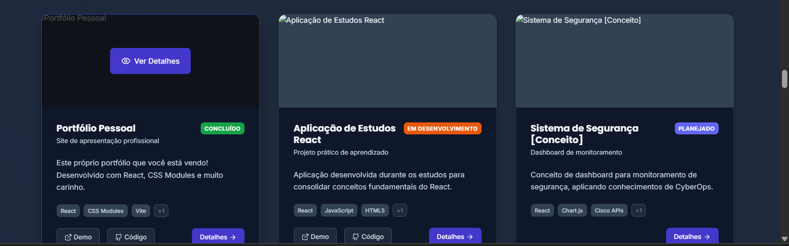

# 🚀 Portfólio - Reginaldo Assunção

Portfólio pessoal de desenvolvedor full stack em formação, desenvolvido como projeto de aprendizado e showcasing de habilidades técnicas.

## 📸 Preview



> 💡 **[Ver Online](https://seu-portfolio.vercel.app)** | **[Demo Interativo](#)** 🚀

## 👨‍💻 Sobre

Sou **Reginaldo Assunção**, profissional com 19 anos de experiência na Vale, formado em múltiplas engenharias e atualmente finalizando pós-graduação em **Análise e Desenvolvimento de Sistemas** pela PUC Minas. Este portfólio representa minha transição para a área de tecnologia, combinando experiência sólida com paixão por inovação.

## 🛠️ Tecnologias Utilizadas

### Frontend
- **React 18** - Biblioteca principal
- **Vite** - Build tool e dev server
- **CSS Modules** - Estilização isolada
- **Lucide React** - Ícones modernos

### Funcionalidades
- ✅ Design responsivo (mobile-first)
- ✅ Dark/Light mode toggle
- ✅ Animações CSS suaves
- ✅ SEO otimizado
- ✅ Acessibilidade (WCAG)
- ✅ Performance otimizada

### Deploy
- **Vercel/Netlify** ready
- Build otimizado para produção
- Configurações de cache

## 🤖 Desenvolvido com IA

Este projeto foi desenvolvido com auxílio do **Claude Code**, demonstrando a integração de ferramentas modernas de IA no processo de desenvolvimento. A IA foi utilizada como ferramenta de:

- ✅ **Planejamento estruturado** - Organização em fases
- ✅ **Otimização de código** - Melhores práticas
- ✅ **Aceleração do aprendizado** - Conceitos avançados
- ✅ **Produtividade** - Desenvolvimento eficiente

> **Nota**: Todo o código foi analisado, compreendido e pode ser explicado detalhadamente. A IA foi uma ferramenta de apoio, não substituição do conhecimento técnico.

## 📁 Estrutura do Projeto

```
src/
├── components/           # Componentes React
│   ├── Header.jsx       # Navegação e menu
│   ├── Hero.jsx         # Seção principal
│   ├── About.jsx        # Sobre mim
│   ├── Skills.jsx       # Habilidades
│   ├── Projects.jsx     # Projetos
│   ├── Experience.jsx   # Experiência
│   ├── Contact.jsx      # Contato
│   └── ThemeToggle.jsx  # Toggle dark/light
├── contexts/            # Context providers
│   └── ThemeContext.jsx # Gerenciamento de tema
├── styles/              # Estilos globais
│   ├── variables.css    # CSS Variables
│   ├── reset.css        # CSS Reset
│   └── utilities.css    # Classes utilitárias
└── assets/              # Imagens e recursos
```

## 🚀 Como Executar

### Pré-requisitos
- Node.js 18+ 
- npm ou yarn

### Instalação

```bash
# Clone o repositório
git clone https://github.com/reginaldo-assuncao/portfolio

# Entre na pasta
cd portfolio

# Instale as dependências
npm install

# Execute em modo desenvolvimento
npm run dev

# Build para produção
npm run build

# Preview da build
npm run preview
```

## 📈 Scripts Disponíveis

```json
{
  "dev": "vite",                    // Servidor de desenvolvimento
  "build": "vite build",           // Build de produção
  "preview": "vite preview",       // Preview da build
  "lint": "eslint . --ext js,jsx"  // Lint do código
}
```

## 🎨 Features Implementadas

### 🌓 Dark/Light Mode
- Toggle animado com persistência
- Detecção automática da preferência do sistema
- Transições suaves entre temas

### 📱 Design Responsivo
- Mobile-first approach
- Breakpoints: 320px, 768px, 1024px+
- Layout flexível e adaptável

### ⚡ Performance
- Code splitting automático
- Lazy loading de componentes
- Otimização de imagens
- CSS e JS minificados

### ♿ Acessibilidade
- Navegação por teclado
- Screen reader support
- Contraste adequado
- Reduced motion support

## 🌟 Destaques do Projeto

### 🎯 Experiência Única
- **19 anos na Vale** - Experiência sólida em operações
- **3 graduações** - Eng. Ambiental + Seg. Trabalho + ADS
- **Cisco CyberOps** - Certificação em segurança cibernética
- **Transição tech** - Combinando experiência com inovação

### 💼 Habilidades Demonstradas
- **React** - Hooks, Context, Components
- **CSS** - Modules, Animations, Responsive
- **JavaScript** - ES6+, Async/Await
- **UX/UI** - Design thinking aplicado
- **SEO** - Otimização completa

## 📞 Contato

- **Email**: reginaldo.assuncao@email.com
- **LinkedIn**: [linkedin.com/in/reginaldo-assuncao](https://linkedin.com/in/reginaldo-assuncao)
- **GitHub**: [github.com/reginaldo-assuncao](https://github.com/reginaldo-assuncao)
- **Localização**: Minas Gerais, Brasil

## 📄 Licença

Este projeto é pessoal e está disponível para visualização e inspiração. 

---

**Desenvolvido com ❤️ por Reginaldo Assunção**

*"Combinando 19 anos de experiência sólida com paixão por tecnologia"*
